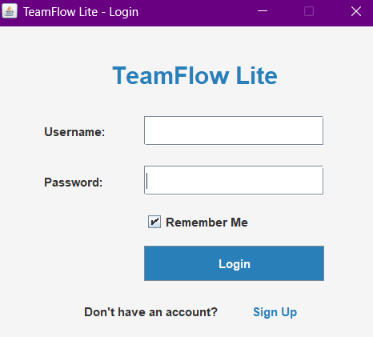

# TeamFlow Lite – Mini Task Tracker

A simple task management system designed for small teams to track individual contributions, deadlines, and progress with ease. Built using Java Swing and file-based storage — no database required.

> 🧠 **Note:** This project was created using **Pieces for Developers** and **Cursor AI**, purely out of curiosity to explore their coding assistance capabilities.

🔗 **GitHub Repository:**  
[https://github.com/mhtamim136/TeamFlow-Lite-Mini-Task-Tracker](https://github.com/mhtamim136/TeamFlow-Lite-Mini-Task-Tracker)

---

## 🔧 Features

- 🧑‍💻 Member Registration & Login  
- 📋 Task CRUD Operations (Create, Read, Update, Delete)  
- 🕒 Deadline and Duration Tracking  
- 📊 Progress Overview per Team Member  
- 💾 Data stored using File I/O (no database)

---


##  🚀 Getting Started

> **1.** Clone the repository:

```bash
  https://github.com/mhtamim136/TeamFlow-Lite-Mini-Task-Tracker.git
```

> **2.** Run the program using the batch file:

```bash
  run.bat

```
⚠️ Make sure you have Java installed and added to your system PATH.


## 📌 Notes

- This project is fully offline and runs without any IDE.
- No database or external library is used.
- All compiled .class files are excluded via .gitignore.


## 🖼️ Screenshots

### 🔹 Login Page

### 🔹 SignUP Page

### 🔹 HomePage


## Author
**Murad Hasan Tamim**  
Student of Computer Science & Engineering  
American International University-Bangladesh (AIUB) 
<br> [@mhtamim136](https://github.com/mhtamim136)


